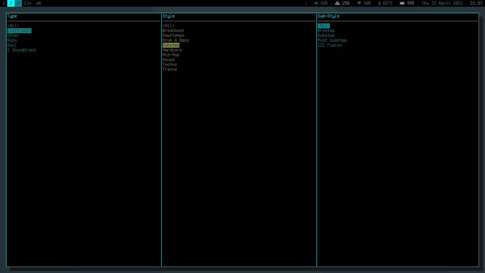
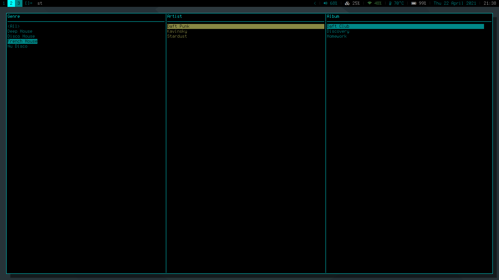
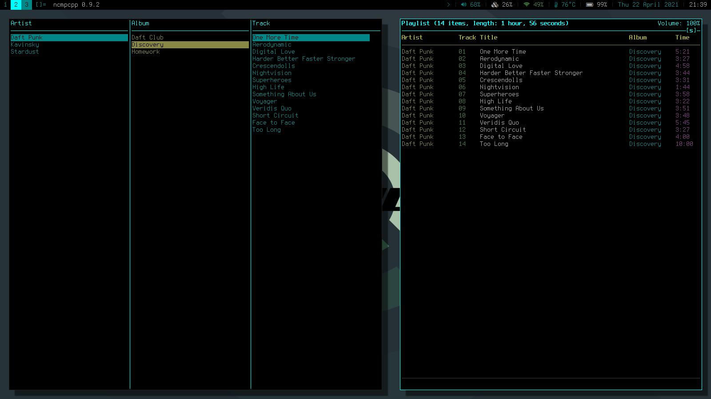

# Style Freak
Very small mpd client with limited functionality. Generates a genre-subgenre tree that the user can traverse to see all tracks falling under that genre selection. At any point, the user can add all tracks falling under the currently selected parameters to the mpd queue. Tracks will only be considered to fall under the selected genre if their "genre" tag matches one of the lowest level subgenres under a genre. Genres and their subgenres are parsed from a simple textfile listing genres, and subgenres underneath them, with a tab depth 1 more than the parent genre

## usage
style_freak <genre_file> [mpd_ip:mpd_port]
* if ip and port are not provided, will default to 127.0.0.1:6600

## Example genre file
    Electronic
    	House
    		Deep House
    		French House
    	Dubstep
    		Brostep
    		Chillstep
    		Dubstep
    Rock
    	Alternative
    	Metal

According to the above rules...
* A file with a genre of Deep House would fall under Deep House, House, and Electronic
* A file with a genre of Dubstep would fall under Dubstep, Dubstep, and Electronic
* A file with a genre of House WOULD NOT fall under House or Electronic

## Controls
* Left/h: Move to parent menu
* Down/j: Move down in current menu
* Up/k: Move up in current menu
* Right/l: Move to child menu
* Space: Add selection to mpd queue
* /: Perform a search on the current menu

## Notes
Originally I wanted to make an entire music player modeled after ncmpcpp but with more flexibility like foobar2000, configured via textfiles. After a while though, I decided that I generally like ncmpcpp and it'd be a lot of work for not a lot of payoff. Therefore, I scrapped the majority of the project to work on other things and limited scope to the one thing I really wanted, genre sorting and the ability to customize that sorting

## To Do
* `<All>` options in Artist, Album, and Track menus

